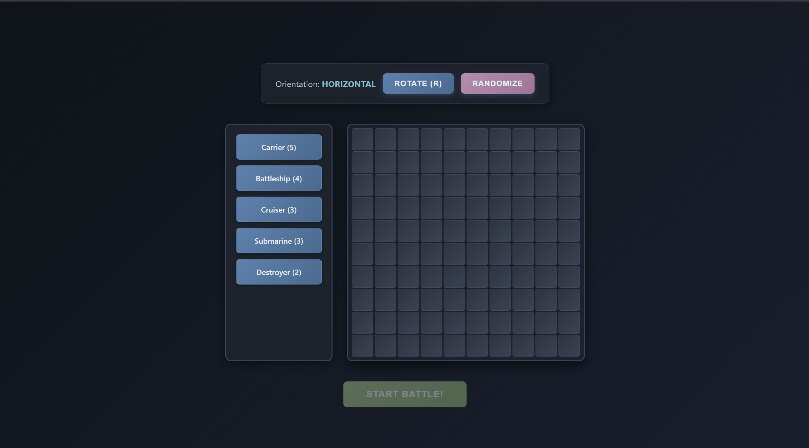
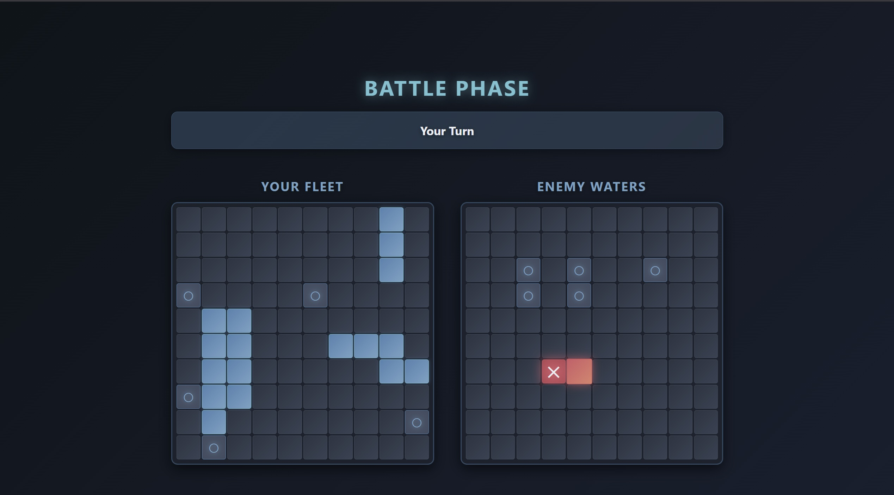

# 🧠 Battleship Game Project

The Battleship Game Project is a comprehensive implementation of the classic Battleship game, where two players try to sink each other's ships by guessing their locations on a grid. The project is built using a variety of technologies, including JavaScript, Webpack, and Babel, and features a range of functionalities, including game initialization, ship placement, and attack tracking. The project's core features include a gameboard, game controller, and player management, making it a robust and engaging game experience.

## 🚀 Features

- Game initialization and setup
- Ship placement and tracking
- Attack tracking and validation
- Game controller for managing game state and turns
- Player management for human and computer players
- Random ship placement utility for generating random ship coordinates

## 🛠️ Tech Stack

- Frontend: JavaScript, HTML, CSS
- Backend: None
- Build Tools: Webpack, Babel
- Testing: Jest
- Linting: ESLint
- Formatting: Prettier
- Dependencies: @babel/core, webpack, jest, eslint, prettier

## 📦 Installation

To install the project, follow these steps:

1. Clone the repository using `git clone`
2. Install dependencies using `npm install`
3. Build the project using `npm run build`
4. Start the development server using `npm start`

## 💻 Usage

To use the project, follow these steps:

1. Open the game in a web browser
2. Initialize a new game by clicking the "Start Game" button
3. Place ships on the gameboard by clicking on the grid
4. Attack the opponent's ships by clicking on the grid
5. Switch turns and track the game state

## 📂 Project Structure

```markdown
.
├── index.js
├── webpack.config.js
├── package.json
├── src
│ ├── models
│ │ ├── Ship.js
│ │ ├── GameModule.js
│ │ ├── Gameboard.js
│ │ ├── Player.js
│ │ ├── GameController.js
│ ├── utils
│ │ ├── placeShipRandomly.js
│ ├── index.js
├── dist
├── node_modules
```

## 📸 Screenshots

Placement Phase\


Battle Phase

